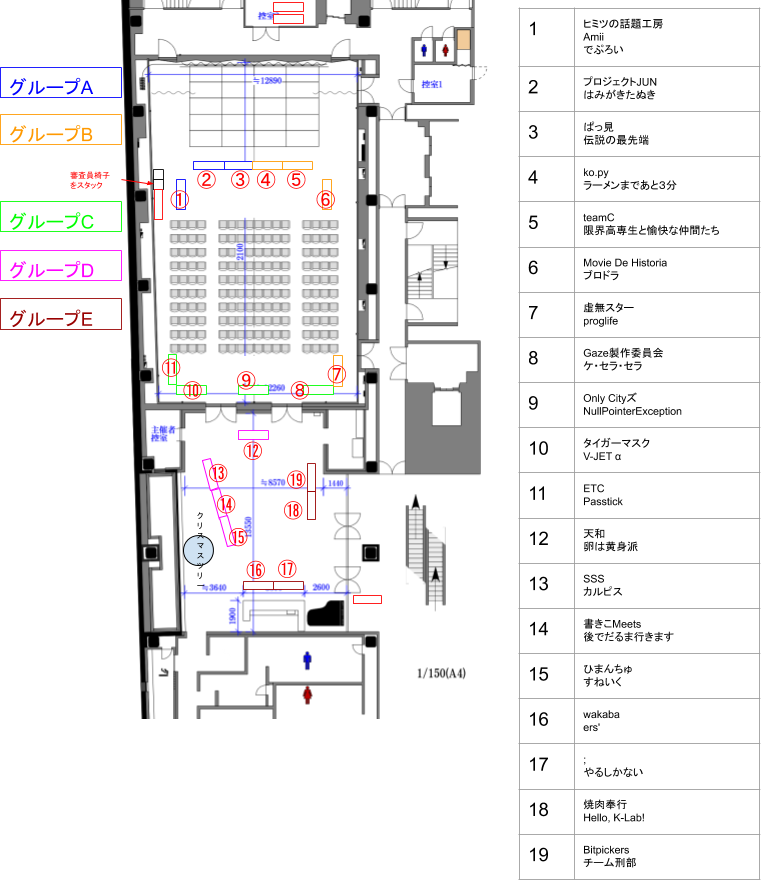

# 審査グループ 担当手引

## この資料について

2019年12月21日(土) チャレキャラのコンテストの第１部「デモブース発表」にて、
１つの審査グループを担当するメンター様に向けた手引書です。

**これは小野さんの資料です。**

## デモブース発表について

今年のチャレキャラは、３９チームがコンテストに参加します。

チャレキャラを第１部、第２部に分けまして、
前半では「デモブース発表」にて、審査員による一次選考が行われます。
その選考結果によって、第２部の「決戦発表」に進むチームが１０チーム選抜されます。

### デモブース発表の内容

「デモブース発表」では、会場を５つの審査グループ（審査グループA ~ E）に分割します。

それぞれの審査グループには、次のように配置が行われます。

- 審査グループ担当メンター 1 名
- 審査員 2~3 名
- 学生（チーム、または個人） 7~8 グループ

### 審査の流れ

審査グループに配置された審査員の方々が、学生ブースを巡回し、審査を行います。
デモブース発表の時間が終わったら、審査員は控え室に戻り、
第２部の「決戦発表」に進むチームを選抜します。

## 審査グループ担当メンターのやること

1. 「デモブース発表」の時間になったら、自分の担当する審査グループに移動する
1. 長机の移動、机にチーム名を背張りするなど、学生が審査を受けるためのブースセッティング
1. 担当学生たちの準備をフォローする（困っていたらヘルプする程度で大丈夫です）
1. 準備完了したら、審査員を控え室から自分の審査グループにお連れする（もしお連れする余裕がないときは、合図をもらえれば、別のメンターが審査員を連れてきます）
1. **審査員がすべての学生グループを漏れなく審査するように**誘導をお願いします（時間内に審査を受けられなかった学生がないように注意をお願いします。**１チームの審査目安時間は８分程度です**）

概ね、以上の役割となります。
あとは、臨機応変にご対応をいただけますと助かります。

## 審査グループ情報

小野さんの審査グループは「**審査グループ A**」となります。

### 会場レイアウト

### 審査グループ A の学生リスト

- プロジェクトJUN (プロジェクトジュン)
- ヒミツの話題工房 (ヒミツノワダイコウボウ)
- はみがきたぬき (ハミガキタヌキ)
- ぱっ見 (パッケン)
- 伝説の最先端 (デンセツノサイセンタン)
- Amii (エイミー)
- でぷろい (デプロイ)

計７チーム

### 審査グループ A の審査員

- 福岡県商工部新産業振興課 西山 寛治（にしやま　かんじ） 様
- 福岡工業大学 情報工学部 情報工学科　准教授 石原　真紀夫（いしはら　まきお） 様
- 株式会社uzufactory　代表取締役 近藤 卓也（こんどう　たくや） 様

計３名
